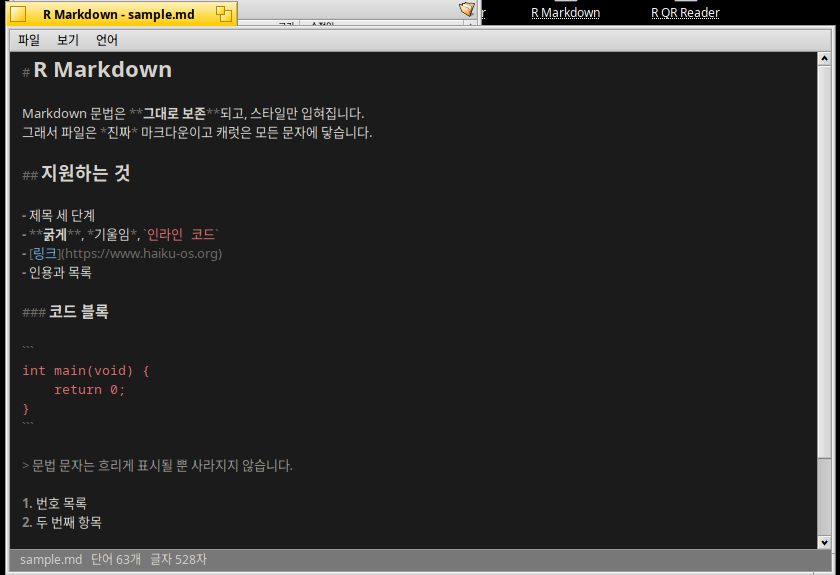

# R Markdown for Haiku OS

[한국어](README.ko.md)

A Markdown editor that styles the text in place. The document stays plain Markdown — the syntax characters are never hidden or rewritten, just dimmed, while what they mark up is styled. A heading looks like a heading and **bold** looks bold, but the file on disk is exactly what you typed and the caret can reach every character.



## Requirements

Haiku OS (x86 or x86_64). Build it on the machine you are going to run it on — no cross-compiler needed.

## Install

```sh
./install.sh
```

This compiles it, puts the binary in `~/config/non-packaged/apps/`, adds it to **Deskbar → Applications**, and puts a link on the Desktop.

```sh
./install.sh --build-only   # compile in place, install nothing
./install.sh --uninstall    # remove it again
```

## Using it

Open a file from **File → Open**, or pass it on the command line:

```sh
"R Markdown" notes.md
```

Styled: three heading levels, bold, italic, bold italic, inline code, fenced code blocks, block quotes, bulleted and numbered lists, links, horizontal rules.

| Menu | |
|---|---|
| **View → Larger / Smaller text** | `Alt+plus` / `Alt+minus`, remembered between runs |
| **View → Dark mode** | `Alt+D`. First run follows the desktop theme, then remembers your choice |
| **Language** | English or Korean; starts in the system language |

Korean and other input-method text entry works normally.

## License

MIT

## AI disclosure

This program was written with Claude.
